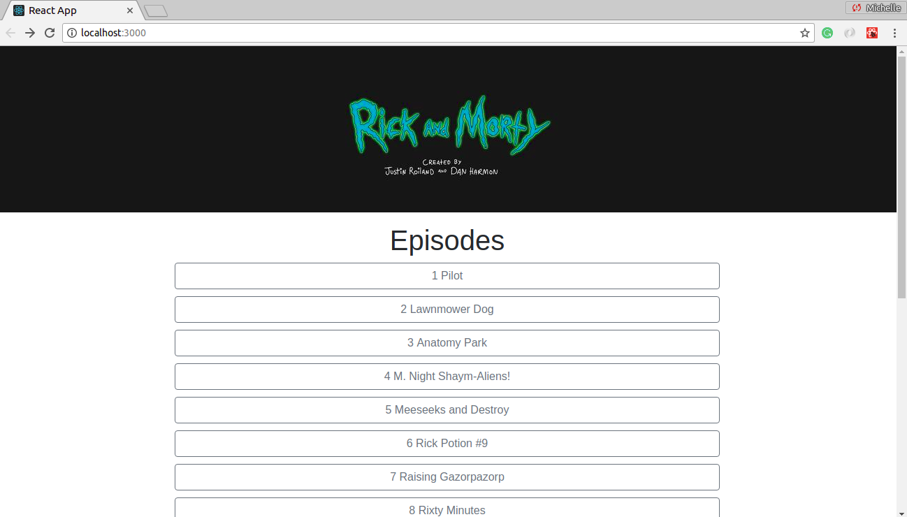
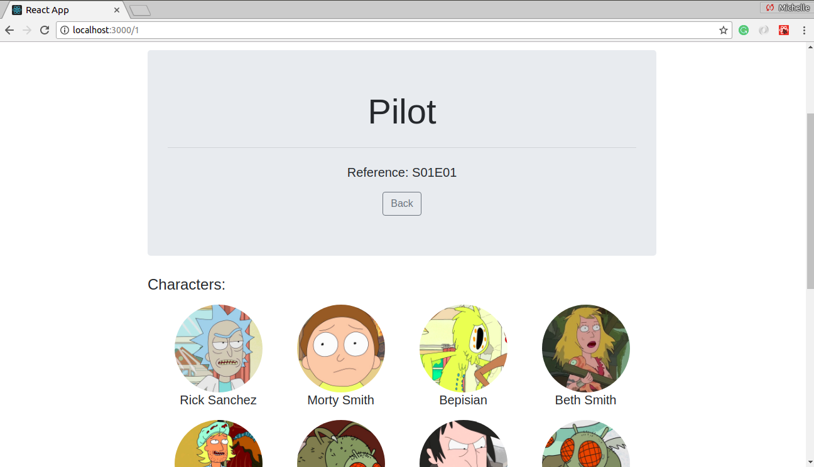

# react-fetch-data
This is an example of how to work with API calls with React and axios. I did a call of an API inside another call. Initially, it was a test for a vacancy of React Developer.

I used the amazing React Facebook library, axios and React Router. Also, I used the [Rick and Morty API]: https://rickandmortyapi.com/.

To use it, you only need to download this project and inside of the folder, and type the following command: `npm install` and after `npm start`. The application should open automaticaly. If it doesn't, just open the browser and type: `localhost:3000`.

##Sample of the first page

##Sample of the details page

